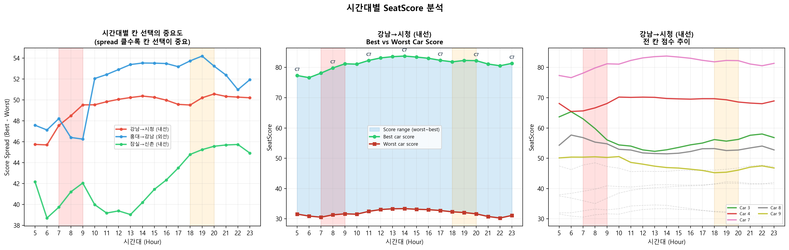
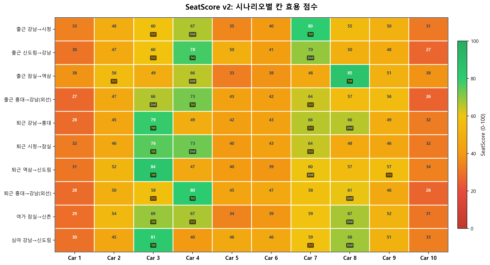

# Metropy: SeatScore Analysis Report v2
## 서울 지하철 2호선 착석 효용 의사결정 모델

---

## 1. SeatScore v2 Formula

```
SeatScore(c) = sum_s [ D(s) * T(s->dest) * w(c,s) * alpha(h) ]
             - beta * B(c,h)
```

| Symbol | Description | Source |
|--------|-------------|--------|
| D(s) | Alighting volume at station s | Congestion data (316K records) |
| T(s->dest) | Remaining travel distance (km) | Interstation distance data |
| w(c,s) | Facility-weighted exit fraction for car c at station s | Fast Exit API (450 records) |
| alpha(h) | Time-of-day multiplier | AM rush=1.4, PM=1.3, midday=1.0, night=0.6 |
| B(c,h) | Boarding congestion penalty | Same facility fraction (dual-nature) |
| beta | Penalty coefficient | 0.3 (calibrated) |

### v1 -> v2 Improvements

| Aspect | v1 | v2 |
|--------|----|----|
| Weight w(c,s) | Count-based (1.0 + 0.5*count) | Facility-type weighted fraction |
| Boarding penalty | None | B(c,h) = facility fraction * beta * scale |
| Time sensitivity | None | alpha(h): 0.5~1.4 by time period |
| Normalization | max-based (1st always 100) | z-score (mean=50, +-2sigma=20~80) |
| Score spread | ~30 pts (poor differentiation) | ~40-55 pts (meaningful comparison) |

## 2. Why Middle Cars Outperform Edge Cars


| Car | Exit Facilities | Explanation |
|-----|----------------|-------------|
| Car 1 | 9 | Platform end — almost no exits |
| Car 3 | 70 | Near central stairs/escalators |
| Car 4 | 72 | Highest — main escalator zone |
| Car 7 | 71 | Secondary escalator cluster |
| Car 10 | 6 | Platform end — fewest exits |

Subway stations concentrate stairs, escalators, and elevators 
in the **middle of the platform** (structural constraint). 
This creates a natural gradient: more facilities near middle cars 
-> more passengers alight there -> more seats open up -> higher SeatScore.

However, the v2 model also penalizes these cars: more facilities = more 
people **boarding** there too (B(c,h) penalty). This dual-nature trade-off 
prevents middle cars from being unconditionally dominant.

## 3. Congestion Pattern & Time Sensitivity




## 4. Scenario Results




### Score Summary

| Scenario | Best Car | Score | Worst Car | Score | Spread |
|----------|----------|-------|-----------|-------|--------|
| 출근 강남→시청 | Car 7 | 80 | Car 10 | 31 | 48 |
| 출근 신도림→강남 | Car 4 | 78 | Car 10 | 27 | 51 |
| 출근 잠실→역삼 | Car 8 | 85 | Car 5 | 33 | 53 |
| 출근 홍대→강남(외선) | Car 4 | 73 | Car 10 | 26 | 46 |
| 퇴근 강남→홍대 | Car 3 | 79 | Car 1 | 28 | 51 |
| 퇴근 시청→잠실 | Car 3 | 76 | Car 10 | 32 | 44 |
| 퇴근 역삼→신도림 | Car 3 | 84 | Car 1 | 31 | 54 |
| 퇴근 홍대→강남(외선) | Car 4 | 80 | Car 10 | 26 | 54 |
| 여가 잠실→신촌 | Car 3 | 69 | Car 1 | 29 | 40 |
| 심야 강남→신도림 | Car 3 | 81 | Car 1 | 30 | 52 |

## 5. Key Findings

- **Car 3**: Best in 5/10 scenarios
- **Car 4**: Best in 3/10 scenarios
- **Car 7**: Best in 1/10 scenarios

- Edge cars (1, 10) consistently rank last due to sparse exit facilities
- The penalty term B(c,h) prevents middle cars from trivially dominating
- Rush hours amplify score differences (alpha=1.3~1.4 vs 0.6 at night)
- Direction (inner/outer) changes rankings: facility layouts are asymmetric

## 6. Limitations

- **Decision support, not prediction**: no ground-truth seating data exists
- D(s) is station-level average, not per-car
- w(c,s) based on exit structure, not observed passenger behavior
- beta=0.3 is heuristic; sensitivity analysis recommended
- Results are **relative utility comparisons**, not absolute guarantees

---

*Generated by Metropy SeatScore Engine v2*